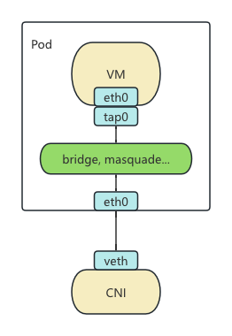

In the new KubeVirt v1.4 release, the [Network Binding Plugin](https://kubevirt.io/user-guide/network/network_binding_plugins/) has been elevated to Beta, offering a new way to extend KubeVirt's networking capabilities. Although it is nominally designed to enhance networking, in practice, this mechanism can do much more. Any changes related to the libvirt domain XML can be implemented through this mechanism.

## KubeVirt Network Overview

First, let's examine the existing networking mechanisms in KubeVirt and identify their shortcomings, as well as how the new mechanism facilitates extensions.

Since KubeVirt uses an architecture where VMs run inside Pods, it reuses the CNI networking mechanism. This approach divides networking into two parts: one is the Pod network provided by various CNIs, and the other is how the CNI-provided network is connected to the VM. In libvirt, this part is referred to as the Domain network.

KubeVirt's previous networking mechanisms (Bridge, Masquerade, Passt, Slirp) essentially connect the Pod's `eth0` interface to the VM's `tap0` network interface using different technical solutions. For example, Bridge connects `tap0` and `eth0` to the same bridge, Masquerade routes `tap0` traffic through iptables NAT rules into `eth0`, and Passt and Slirp perform traffic redirection via a user-space network stack.

These methods are similar in implementation: they perform some network-related configurations inside the Pod and then modify libvirt's startup parameters to connect to the respective network. However, the existing mechanisms are hardcoded into KubeVirt Core and lack an extension mechanism. Adding a new mechanism or modifying an existing one requires altering KubeVirt's code, which is inflexible. For instance, the default bridge plugin hijacks DHCP requests but does not support IPv6, making dual-stack configurations under bridge mode difficult to achieve. Additionally, the DHCP implemented in Kube-OVN is bypassed by this mechanism. Previously, enabling dual-stack bridge required modifying KubeVirt's code to disable the default DHCP, which was cumbersome. Therefore, the new version abstracts this set of mechanisms to provide a universal extension framework.

## Hook Sidecar

Let's first look at an existing extension mechanism in KubeVirt: the [Hook Sidecar](https://kubevirt.io/user-guide/user_workloads/hook-sidecar/).

This mechanism allows loading a user-defined image or a Shell/Python script stored in a ConfigMap before the VM is officially created. It modifies libvirt's startup parameters and cloud-init parameters before the VM starts.

Its execution mechanism is somewhat similar to CNI. Before starting a VM, `virt-handler` searches the corresponding directory for two binaries: `/usr/bin/onDefineDomain` and `/usr/bin/preCloudInitIso`. The former takes the libvirt XML configuration generated by `virt-handler` as input and returns the modified configuration; the latter takes the cloud-init configuration and returns the modified cloud-init configuration. This way, any libvirt and cloud-init parameters not natively supported by KubeVirt can be injected and modified through this mechanism. Moreover, since the Sidecar can execute arbitrary code, it can do much more than just modify these two configurations. Any capabilities not implemented by KubeVirt during the initialization phase can be realized here.

## Network Binding Plugin

Now let's discuss the Network Binding Plugin mechanism, which is fundamentally similar to the Hook Sidecar. The main difference is that it replaces binary calls with gRPC calls. The methods registered in gRPC remain `onDefineDomain` and `preCloudInitIso`, but the parameters are passed through gRPC requests instead of command-line arguments. Everything else remains the same.

A specific example can be found in the [Slirp Binding](https://github.com/kubevirt/kubevirt/tree/main/cmd/sidecars/network-slirp-binding) implementation, which is still part of the KubeVirt codebase. Although the Network Binding Plugin specification has added a `networkAttachmentDefinition` field to select a CNI, this can still be achieved using the previous network interface selection mechanism. Furthermore, since the Sidecar can execute arbitrary code, it is also possible to implement a CNI within the Sidecar to override the Pod's original network.

The resulting network architecture is depicted in the diagram below:

## Conclusion

Although the Network Binding Plugin mechanism is designed for network extensions, it can actually extend almost all processing logic on the `virt-handler` side of KubeVirt. It even allows treating KubeVirt as merely a framework, with all logic handled through Sidecars. This flexibility is expected to enable numerous innovative uses in the future.

## References

- [Hook Sidecar](https://kubevirt.io/user-guide/user_workloads/hook-sidecar/)
- [Network Binding Plugins](https://kubevirt.io/user-guide/network/network_binding_plugins/)
- [Network Binding Plugin Documentation](https://github.com/kubevirt/kubevirt/blob/main/docs/network/network-binding-plugin.md)
- [Slirp Binding Implementation](https://github.com/kubevirt/kubevirt/tree/main/cmd/sidecars/network-slirp-binding)